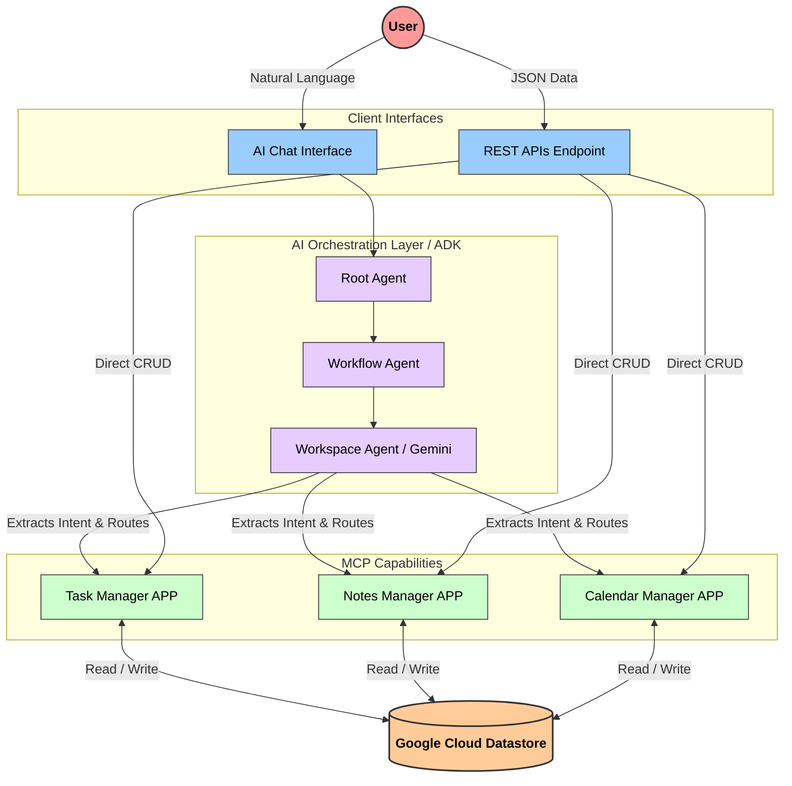

# Planify Process Flow & Architecture Diagram

To view this diagram as a clear image, **right-click anywhere in this file and select "Open Preview"** (or click the magnifying glass with a split-screen icon in the top right corner of VS Code).

